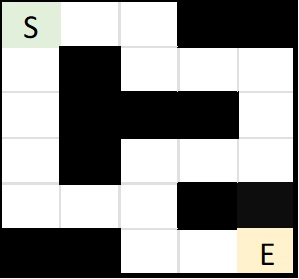
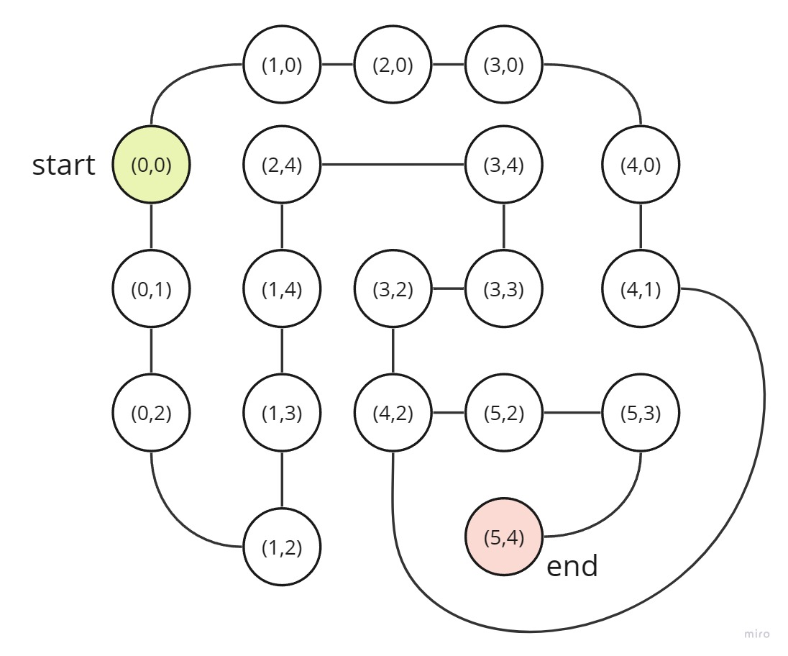
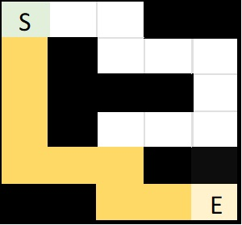
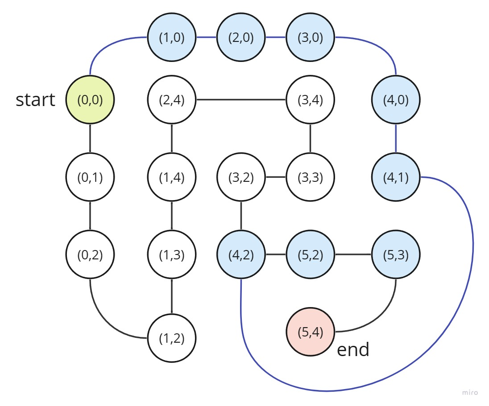

# Día 9: Encontrar la ruta más corta en un laberinto

Dado un laberinto representado por una matriz, donde `0` representa un camino libre y `1` representa una pared, encuentra la ruta más corta desde una posición inicial hasta una posición objetivo. Puedes moverte en las direcciones arriba, abajo, izquierda y derecha. Puedes asumir que siempre hay una ruta válida desde la posición inicial hasta la posición.

- [Día 9: Encontrar la ruta más corta en un laberinto](#día-9-encontrar-la-ruta-más-corta-en-un-laberinto)
  - [Contexto](#contexto)
  - [Solución](#solución)
  - [Ejecución](#ejecución)
  - [Resultados](#resultados)

## Contexto

Para este reto se puede plantear una solución con [teoría de grafos](https://en.wikipedia.org/wiki/Graph_theory). Definimos los laberitos en formato json como se muestra en el siguiente ejemplo:

```json
{
    "l": [
        [0,0,0,1,1],
        [0,1,0,0,0],
        [0,1,1,1,0],
        [0,1,0,0,0],
        [0,0,0,1,1],
        [1,1,0,0,0]
    ],
    "start": [0,0],
    "end": [5,4]
}
```

Lo que se podría visualizar de la siguiente forma:

<p align="center">
  
</p>

Se asume que siempre hay una ruta válida desde la posición inicial hasta la posición final.

Estos laberintos se convertirán a un grafo, donde cada nodo representa una posición en el laberinto y cada arista representa un movimiento entre dos posiciones. Por ejemplo, el laberinto anterior se convertiría en el siguiente grafo ponderado de pesos `1` en todas las aristas:

<p align="center">
  
</p>

Gracias a que ahora está representado como un grafo, se puede aplicar el [algoritmo de Dijkstra](https://en.wikipedia.org/wiki/Dijkstra's_algorithm) para encontrar la ruta más corta entre el nodo inicial y el nodo final.

## Solución

Definimos una función que tome el laberinto como matriz y lo transforme a un diccionario de adyacencia, donde cada nodo es una posición en el laberinto y cada arista es un movimiento entre dos posiciones. Para esto, se recorre la matriz y se agregan las aristas correspondientes a cada nodo.

```python
def get_adjacency_dict(L):
    G = {}

    m = len(L)
    n = len(L[0])

    for i in range(m):
        for j in range(n):
            if L[i][j] != 0:
                continue

            G[(i, j)] = []
            if i + 1 < m:
                if L[i + 1][j] == 0:
                    G[(i, j)].append((i + 1, j))

            if j + 1 < n:
                if L[i][j + 1] == 0:
                    G[(i, j)].append((i, j + 1))

    return G
```

Definimos una función que tome el grafo y encuentre la ruta más corta entre el nodo inicial y el nodo final. Para esto, se utiliza el algoritmo de Dijkstra.

```python
def find_shortest_path(G: dict, start: tuple, end: tuple):
    dist = {node: inf for node in G.keys()}
    prev = {node: None for node in G.keys()}

    dist[start] = 0

    unvisited = set(G.keys())

    while unvisited:
        current = min(unvisited, key=lambda node: dist[node])
        unvisited.remove(current)

        if dist[current] == inf:
            break

        for neighbour in G[current]:
            alt = dist[current] + 1
            if alt < dist[neighbour]:
                dist[neighbour] = alt
                prev[neighbour] = current

    path = []
    current = end
    while prev[current]:
        path.append(current)
        current = prev[current]
    path.append(current)

    return path[::-1]
```

## Ejecución

El programa está implementado de tal forma que tome desde consola un archivo json con la información del laberinto. Para ejecutar el programa se debe ejecutar el siguiente comando:

```bash
python main.py <input.json> [print]
```

La opción `print` es opcional y permite imprimir el grafo con el laberinto.

## Resultados

En el directorio `samples` se encuentran algunos ejemplos de laberintos y sus respectivas soluciones. A continuación se muestran los resultados de ejecutar el programa con uno de estos ejemplos.

```bash
python .\main.py .\samples\1.json print
{(0, 0): [(1, 0), (0, 1)],
 (0, 1): [(0, 2)],
 (0, 2): [(1, 2)],
 (1, 0): [(2, 0)],
 (1, 2): [(1, 3)],
 (1, 3): [(1, 4)],
 (1, 4): [(2, 4)],
 (2, 0): [(3, 0)],
 (2, 4): [(3, 4)],
 (3, 0): [(4, 0)],
 (3, 2): [(4, 2), (3, 3)],
 (3, 3): [(3, 4)],
 (3, 4): [],
 (4, 0): [(4, 1)],
 (4, 1): [(4, 2)],
 (4, 2): [(5, 2)],
 (5, 2): [(5, 3)],
 (5, 3): [(5, 4)],
 (5, 4): []}

Shortest path: [(0, 0), (1, 0), (2, 0), (3, 0), (4, 0), (4, 1), (4, 2), (5, 2), (5, 3), (5, 4)]
```

De forma gráfica se puede ver el laberinto y la ruta más corta:

<p align="center">
  
</p>

La ruta representada en el grafo:

<p align="center">
  
</p>

[crixodia](https://instagram.com/crixodia)
