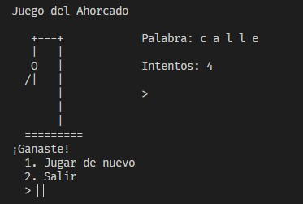

# Día 24: Ahorcado

Pedro quiere jugar al ahorcado con su hermano. Ayuda a Pedro a escribir un programa que le permita jugar al ahorcado. El programa debe seleccionar una palabra al azar de una lista predefinida y permitir al jugador ingresar letras hasta adivinar la palabra o perder.

- [Día 24: Ahorcado](#día-24-ahorcado)
  - [Contexto](#contexto)
  - [Solución](#solución)
  - [Resultados](#resultados)

## Contexto

Para la solución de este reto se utilizó la librería curses de Python con el fin de crear una interfaz gráfica para el juego.

## Solución

Puedes encontrar la solución en el archivo [main.py](main.py).

## Resultados

